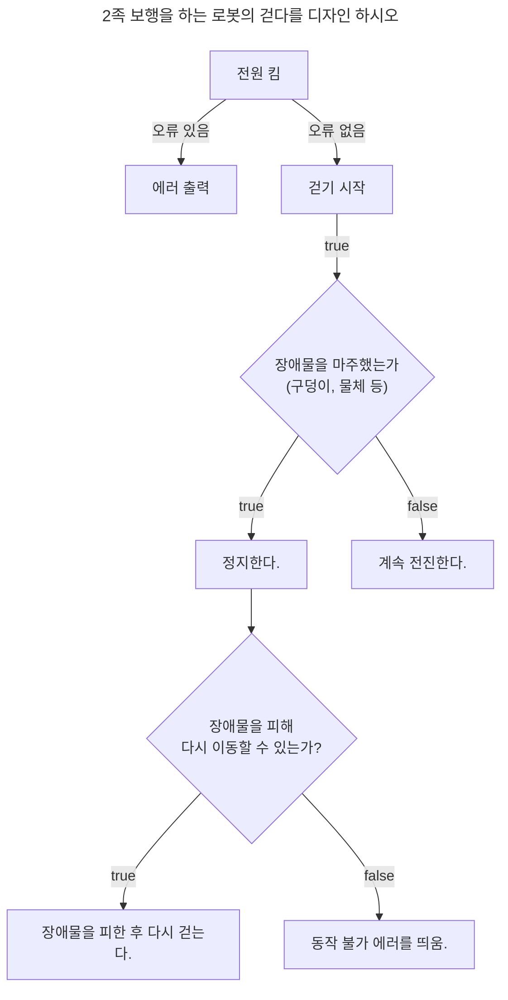

***
# 1장_프로그래밍
***
### 과제1_1번. 2족 보행 로봇이 있습니다. 해당 로봇에 대한 '걷다'라는 기능을 디자인 해보시오.


***
# 2장_JS란?
***
### 과제2_1번
- **Ajax란?** : 
	- **Ajax(Asynchronous JavaScript and XML, 에이젝스)**
	- 비동기적인 웹 애플리케이션의 제작을 위한 웹 개발 기법으로 빠르게 동작하는 동적인 웹 페이지를 만들기 위한 기법 중 하나이다. 
	- 웹 페이지를 전체를 다시 로딩하지 않아도, 웹 페이지의 일부분만을 갱신할 수 있다.(백그라운드 영역에서 서버와 통신하여, 그 결과를 엡 페이지의 일부분에만 표시 가능.)
		-1. HTML, CSS / 표현 정보를 위한
   		-2. DOM, JS / 동적인 화면 출력 및 표시 정보와의 상호작용을 위한.
   		-3. XML, XSLT, XMLHttpRequest / 웹 서버와 비동기적으로 데이터를 교환하고 조직하기를 위한 
	- *장점*
	- 웹 페이지 전체를 다시 로딩하지 않고도, 일부분만 갱신 가능
	- 웹 페이지가 로드된 후 서버로부터 데이터를 요청하고 받을 수 있다.
	- 백그라운드 영역에서 서버로 데이터를 보낼 수 있다.
 	- *단점*
  	- seerver push 방식으로 실시간 서비스를 만들 수 없다.(client pulling 방식을 사용.)
  	- 바이너리 데를 보내거나 받을 수 없다.
  	- Ajax 스크립트가 포함된 서버가 아닌 다른 서버로 Ajax 요청을 보낼 수 없음.
  	- 클라이언트의 PC로 Ajax요청을 보낼 수 없음. 
- **jQuery란?** : 
	- 2006년 존 래시가 제작했으며 클라이언트 측 솔루션 제적을 손쉽게 만들어주는 크로스 플랫폼 js라이브러리로 웹 화면을 다루는 js라이브러리이다.
 	- HTML의 클라이언트 사이드 조작을 단순화 하도록 설계된 크로스 플랫폼의 js라이브러리로 거의 모든 웹 브라우저에 대응할 정도의 브라우저 호환성이 있음.
  	- **HTML문서 탐색**
  	- DOM(문서객체모델)의 내용을 쉽게 탐색함으로써 검색할 노드나 요소, 값에 접근하거나 찾을 수 있다.
  	- **HTML 문서 조작**
  	- 모든 함수와 예제가 브라우저 간 호환이 가능하다.
  	- **이벤트 처리**
  	- 모든 이벤트에 대해 일관된 이름을 정의함을써 작업을 더욱 쉽게 처리할 수 있다.
  	- **Ajax**
  	- Ajax를 지원함.
- **V8이란?**
	- google이 개발한 OSS로 가장 대중적인 js엔진.
 	- 웹 브라우저 내부의 js 수행 속도의 개선을 목표로 고안됨.
  	- 인터프리터를 사용하는 대신 JIT(Just In Time)컴파일러를 구현 -> 커드 실행 시 js코드를 머신코드로 컴파일 함.
  - **Node.js**
  	- 서버측 및 네트워킹 애플리케이션(서버 사이드) 개발에 사용되는 오픈 소스 교차 플랫폼 js 런타임 환경.
   	- Windows OS, Mac OSX, Linux, Unix 및 기타 운영 체제이서 실행되며 Raspberry Pi or Beaglebone Block과 같은 ARM 프로세서 지원.
	- 내장 HTTP 서버 라이브러리를 포함하고 있어 웹 서버에 아파치 등의 별도의 sw없이 동작하는 것이 가능하며 이를 통해 웹 서버의 동작에 있어 더 많은통제를 할 수 있다.
  -  **SPA(Single Page Aplication) Framework**
  	- 단일 페이지 애플리케이션
  	- 서버로부터 완전한 새로운 페이지를 불러오지 않고 현재의 페이지를 동적으로 다시 작성함으로써 사용자와 소통하는웹 애플리케이션이나 웹 사이트 서버 호출이 적은 관계로 속도가 매우 빠르고 트래픽이 적다.
  	- 기존의 모놀리스 방식(전체적인 개발 구성을 하나로 합쳐 배포하는 방식)에서 마이크로서비스 방식으로 변화하는 현재 웹개발의 트렌드이다.
  	- spa예시 : Vue, Angular, React

### 과제2_2. V8 엔진에 대해 정리하시오.
  - Google에서 만들어진 오픈소스 js로 웹 브라우저를 만드는데 기반을 제공.
  - C++로 작성되었으며 다중 스레드 방식을 사용, 환경과 상호작용하고 프로그램을 실행하기 위한 바이트 코드를 생성하는 역할.
  - 구글 크롬, 크로미움 웹 브라우저, Node.js, 안드로이드를 지원.
  - JIT(Just In Time) 컴파일러로 런타임에 모든 js를 기계어로 컴파일하고 중간에 코드를 생성하지 않음.(빠르다)
  - js를 바이트코드로 컴파일, 실행한다. 속도향상을 위해 inline caching을 사용.
  - 브라우저 내부 또는 외부에서 js코드를 실핼하는 서버측 스크립팅(사용자의 작업에 대한 응답으로 웹 페이지에 동적 콘텐츠를 전달하기 위해 클라이언트가 아닌 서버에서 실행되는 경우.)이 가능하다.

***
# 4장_변수
***

### *과제4_1 예약어에 빨간색으로 강조된 것들의 의미를 찾아오시오.*
 - interface
	- 일종의 추상 클래스
 	- 상속을 목적으로 만들어졌으며 다중상속이 가능.
  	- 상수와 추상메소드만 가질 수 있다.(내용 선언 x) 메소드 선언만 되어있고 빈 껍데기
- public
   	- 접근제한자, 그 중 가장 제한이 없음.
   	- 접근 제한이 없기에 같은 클래스, 패키지, 상속에 상관없이 누구나 사용할 수 있다.
- implments
   	- 인터페이스 구현할 때 쓰임, 다중상속 가능
- yield
	- 함수 안에서 사용되는 return과 비슷한 역할을 하는 예약어.
 	- generator 함수의 실행을 일시적으로 정지시키며, yield 뒤에 오는 표현식은 generator의 caller에게 반환됨.
- static
  	- 정적변수 혹은 클래스 변수
   	- 클래스 단위로 존재하며 클래스로부터 만들어진 모든 객체가 공유할 수 있는 변수를 의미.
    	- 한 번만 생성되고, 컴파일 할 때 만들기 때문에 객체생성(인스턴스)이 불필요.
- main
	- 함수보다 먼저 실행됨.(단 한 번만 실행).

 ### 과제4_2 아래의 코드를 실행한 후 결과값과 그 이유를 알아오시오.
 예제1.
 ```JS
console.log(a);
var a;
a = 11;
console.log(a);
```
출력.
``` console
undefined
11
```
js의 큰 특징 중 하나인 회수팅 때문에 a를호출하고 그 이후에 a를 선언하고 값을 주어도 에러가 나지 않고 그 값을 출력함.(첫 번째 a는 값이 없기에 iundefined가 출력)

예제2.
```JS
console.log(a)
a = 10;
var a;
console.log(a);
```
출력.
```console
undefined
10
```
첫번째 예제와 같은 이유로 undefined가 출력되고 그 밑은 10이 출력된다.

### 과제4_3 헝가리안 케이스에 대해 알아오시오.
- 컴퓨터 프로그래밍에서 변수 및 함수의 이름 인자 앞에 데이터 타입을 명시하는 코딩 규정.
- 찰스 시모니가 마이크로소프트의 개발 책임자로 있을 때 제안.
- 다른 타입 접두어 앞에 붙여 사용.
  *장점*
  데이터 타입을 변수명에서 바로 추정할 수 있다.
  vi나 emacs로 터미널에서 작업할 때 편하다.
  같은 이름의 달느 타입 변수가 있을 때 이름 충돌을 방지할 수 있다.
  *단점*
  데이터 타입이 바뀌면 변수 또는 함수 인자의 이름을 바꿔야 한다.
  변수나 함수 인자의 이름을 기억하기 힘들다.
  
현재 추세: IDE의 발전과 디스플레이의 발전으로 변수의 데이터 타입 파악이 쉬워져 쓸모가 사라짐.
